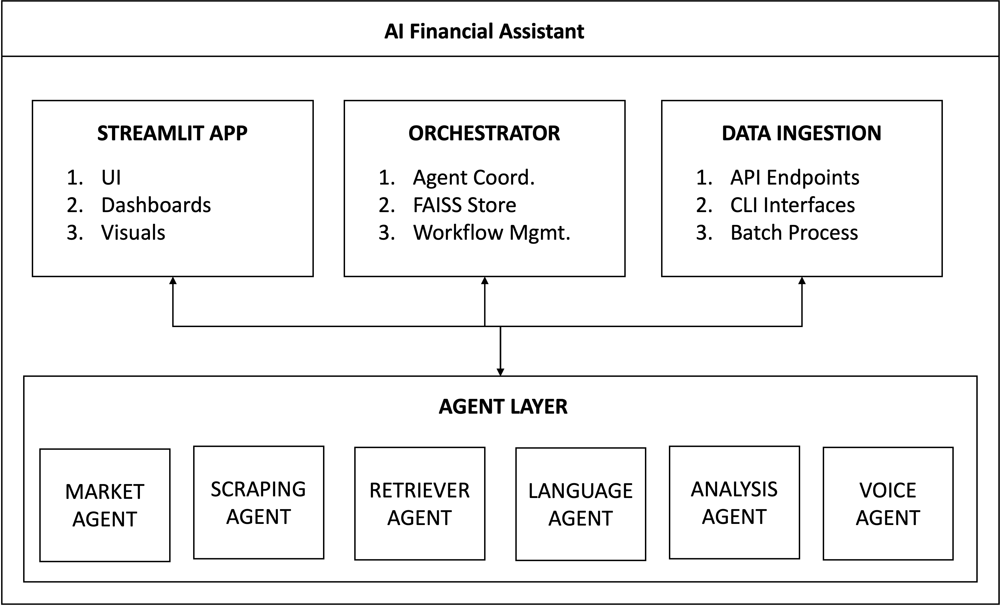

# 🚀 AI Financial Assistant - Multi-Agent System


A comprehensive, modular AI-powered financial assistant featuring multiple specialized agents for market data analysis, web scraping, natural language processing, and voice interaction.

## 🏗️ Architecture Overview



## 📁 Project Structure

```
RagaAI-Assign/
├── agents/                     # AI Agent Implementations
│   ├── core/                   # Core agent logic
│   │   ├── scraping_agent.py   # Web scraping & content extraction
│   │   ├── market_agent.py     # Financial market data retrieval
│   │   ├── retriever_agent.py  # Vector-based document retrieval
│   │   ├── analysis_agent.py   # Financial analysis & insights
│   │   ├── language_agent.py   # NLP & text generation (Mistral AI)
│   │   └── voice_agent.py      # Speech-to-text & text-to-speech
│   └── __init__.py
│
├── data_ingestion/             # Data Input/Output Interfaces
│   ├── api/                    # RESTful API endpoints
│   │   ├── analysis_fastapi.py
│   │   └── ...
│   ├── cli/                    # Command-line interfaces
│   │   ├── analysis_cli.py
│   │   ├── cli_interface.py
│   │   └── ...
│   └── __init__.py
│
├── orchestrator/               # Agent Coordination & Management
│   ├── core/                   # Main orchestration logic
│   │   ├── orchestrator_streamlit.py
│   │   ├── orchestrator_fastapi.py
│   │   └── debug_orchestrator.py
│   ├── faiss/                  # Vector database management
│   │   ├── orchestrator_faiss/
│   │   ├── api_faiss_store/
│   │   └── cli_faiss_store/
│   └── __init__.py
│
├── streamlit_app/              # Web Application Interface
│   ├── components/             # UI components
│   ├── analysis_streamlit.py
│   ├── language_streamlit.py
│   ├── retriever_streamlit.py
│   ├── scraping_streamlit.py
│   ├── streamlit_interface.py
│   ├── voice_streamlit.py
│   └── __init__.py
│
├── docs/                       # Documentation
│   ├── ai_tool_usage.md        # AI tool usage log
│   ├── API_README.md
│   ├── health_checker.md
│   └── ...
│
├── logs/                       # Application logs
├── pids/                       # Process IDs for services
├── market_env/                 # Python virtual environment
│
├── main.py                     # Main FastAPI application
├── requirements.txt            # Python dependencies
├── Dockerfile                  # Docker configuration
├── docker-compose.yml          # Multi-service orchestration
├── README.md                   # This file
└── ...
```

## 🤖 Agent Capabilities

### 1. Market Agent 📈
- **Real-time stock prices** (Yahoo Finance)
- **Historical market data** with configurable periods
- **Company information** and financial metrics
- **Earnings data** (annual/quarterly)
- **Stock search** by name or symbol
- **AlphaVantage API** integration (optional)

### 2. Scraping Agent 🕷️
- **HTML content extraction** from any URL
- **Headline extraction** with CSS selectors
- **Unstructured.io integration** for advanced parsing
- **Generic text extraction** from web pages
- **Robust error handling** and retry mechanisms

### 3. Retriever Agent 🔍
- **Vector-based document storage** using FAISS
- **Semantic search** capabilities
- **Metadata management** for documents
- **Scalable indexing** for large document collections
- **Real-time search** with configurable result counts

### 4. Analysis Agent 📊
- **Investment analysis** by region and sector
- **Portfolio value tracking** and change calculation
- **Sentiment analysis** using VADER
- **Stock price comparison** with percentage changes
- **Financial trend analysis**

### 5. Language Agent 🧠
- **Text summarization** using Mistral AI Nemo
- **Intelligent explanations** tailored to audience
- **Fallback to local models** (DistilBART/T5-small)
- **Configurable output length**
- **Multi-language support**

### 6. Voice Agent 🎤
- **Speech-to-text** using OpenAI Whisper
- **Text-to-speech** with multiple providers:
  - macOS Say command
  - pyttsx3 (cross-platform)
  - ElevenLabs API
  - OpenAI TTS API
- **Real-time voice interaction**
- **Voice provider management**

## 🚀 Quick Start

### Prerequisites
- Python 3.9+
- Virtual environment (recommended)
- Docker (optional)

### Installation

1. **Clone the repository:**
```bash
git clone https://github.com/vishesh9131/RagaAI-Assign.git
cd RagaAI-Assign
```

2. **Set up virtual environment:**
```bash
python -m venv market_env
source market_env/bin/activate  # On Windows: market_env\Scripts\activate
```

3. **Install dependencies:**
```bash
pip install -r requirements.txt
```

4. **Set environment variables:**
```bash
export MISTRAL_API_KEY="your-mistral-api-key"
export ALPHAVANTAGE_API_KEY="your-alphavantage-key"  # Optional
```

### Running the Application

#### Option 1: Individual Services
```bash
# Start main API server
python main.py

# Start orchestrator (in another terminal)
python orchestrator/orchestrator_fastapi.py

# Start Streamlit app (in another terminal)
streamlit run streamlit_app/orchestrator_streamlit.py
```

#### Option 2: Using Service Scripts
```bash
# Start all services
./start_services.sh

# Check service status
./check_status.sh

# Stop all services
./stop_services.sh
```

#### Option 3: Docker Deployment
```bash
# Build and run with Docker Compose
docker-compose up --build

# Run in background
docker-compose up -d
```

### Access Points
- **Main API**: http://localhost:8000/docs
- **Orchestrator API**: http://localhost:8011/docs
- **Streamlit Web App**: http://localhost:8501

## 🔧 Configuration

### Environment Variables
```bash
# Required
MISTRAL_API_KEY=your-mistral-api-key

# Optional
ALPHAVANTAGE_API_KEY=your-alphavantage-key
OPENAI_API_KEY=your-openai-key
ELEVENLABS_API_KEY=your-elevenlabs-key
```

### Service Ports
- Main API: 8000
- Voice Agent: 8001
- Analysis Agent: 8002
- Language Agent: 8003
- Market Agent: 8004
- Retriever Agent: 8005
- Orchestrator: 8011
- Streamlit: 8501

## 📖 Usage Examples

### CLI Interface
```bash
# Market data
python data_ingestion/cli/cli_interface.py price AAPL --period 1y

# Text analysis
python data_ingestion/cli/language_cli.py summarize "Your text here"

# Voice interaction
python data_ingestion/cli/voice_cli.py speak "Hello, world!"

# Web scraping
python data_ingestion/cli/scraping_cli.py extract-text https://example.com
```

### API Usage
```bash
# Get stock price
curl -X GET "http://localhost:8000/market/stock/AAPL/price"

# Summarize text
curl -X POST "http://localhost:8000/language/summarize" \
     -H "Content-Type: application/json" \
     -d '{"text": "Your text here", "max_words": 100}'

# Search documents
curl -X POST "http://localhost:8000/retriever/search" \
     -H "Content-Type: application/json" \
     -d '{"query": "financial analysis", "k": 5}'
```

## 🏥 Health Monitoring

### Comprehensive Health Check
```bash
# Run full health check
python health_checker.py

# Check specific components
python health_checker.py --mode api
python health_checker.py --mode cli

# Verbose output
python health_checker.py --verbose
```

### Service Management
```bash
# Check all service status
./check_status.sh

# View logs
tail -f logs/orchestrator.log
tail -f logs/streamlit.log
```

## 🐳 Docker Deployment

### Single Container
```bash
# Build image
docker build -t ai-financial-assistant .

# Run container
docker run -p 8000:8000 -p 8501:8501 ai-financial-assistant
```

### Multi-Service with Docker Compose
```bash
# Start all services
docker-compose up -d

# View logs
docker-compose logs -f

# Scale services
docker-compose up --scale api=2 --scale orchestrator=2

# Stop services
docker-compose down
```

## 🔍 Framework Comparisons

### Language Models
| Framework | Pros | Cons | Use Case |
|-----------|------|------|----------|
| **Mistral AI** | High quality, API-based, Fast | Requires API key, Cost | Production summarization |
| **Transformers** | Local, Free, Customizable | Resource intensive | Development/Fallback |
| **OpenAI GPT** | Excellent quality, Versatile | Expensive, Rate limits | Premium features |

### Vector Databases
| Framework | Pros | Cons | Use Case |
|-----------|------|------|----------|
| **FAISS** | Fast, Local, No dependencies | Limited features | Document retrieval |
| **Pinecone** | Managed, Scalable | Cost, External dependency | Production scale |
| **Weaviate** | Feature-rich, GraphQL | Complex setup | Advanced use cases |

### Web Frameworks
| Framework | Pros | Cons | Use Case |
|-----------|------|------|----------|
| **FastAPI** | Fast, Auto docs, Type hints | Learning curve | API development |
| **Streamlit** | Rapid prototyping, Easy UI | Limited customization | Dashboards |
| **Flask** | Simple, Flexible | Manual setup | Simple APIs |

## 📊 Performance Benchmarks

### Response Times (Average)
- **Market Data Retrieval**: ~200ms
- **Text Summarization**: ~1.5s (Mistral API)
- **Document Search**: ~50ms (1000 docs)
- **Voice Synthesis**: ~800ms
- **Web Scraping**: ~1.2s (typical webpage)

### Throughput
- **API Requests**: ~100 req/s (single instance)
- **Document Indexing**: ~500 docs/min
- **Concurrent Users**: ~50 (Streamlit)

### Resource Usage
- **Memory**: ~512MB (base) + ~2GB (with models)
- **CPU**: 2-4 cores recommended
- **Storage**: ~1GB (application) + variable (FAISS indices)


## 🆘 Support

- **Documentation**: Check the `docs/` directory
- **Issues**: Create a GitHub issue
- **Health Check**: Run `python health_checker.py`
- **Logs**: Check `logs/` directory for debugging

